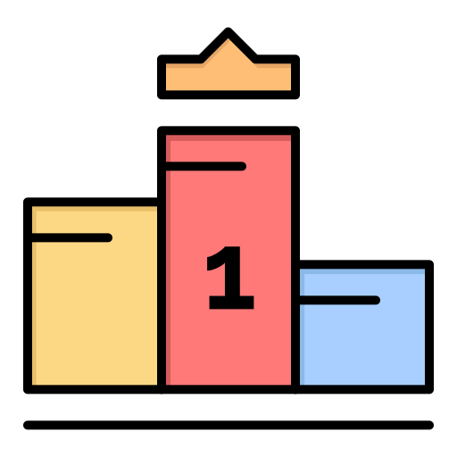

<!DOCTYPE html>
<html lang="ru">
<head>
	<meta charset="UTF-8">
	<meta name="viewport" content="width=device-width, initial-scale=1.0">
	<meta http-equiv="X-UA-Compatible" content="ie=edge">
	<title>Solve Corporation</title>
	<link rel="stylesheet" href="style.css">
	<link rel="shortcut icon" href="data/img/ico.ico" type="image/x-icon">
</head>
<body>

	<!-- Шапка сайта -->
	<header id="headers">
		

			SOLVE
		

		

			<!-- <a id="MainMenu_News" onclick="ControlFunc('ActiveButtonNews_MainMenu')">News</a>
			<a id="MainMenu_Wallet">Wallet</a>
			<a id="MainMenu_Random">Random</a>
			<a id="MainMenu_CreateQR" onclick="ControlFunc('ActiveButtonQRCODE')">Create QR</a>
			<a id="MainMenu_Profile">Profile</a> -->
			<a id="MainMenu_Exit">Sign In</a> 
		

	</header>
	<!---/////////// -->

	<!-- Это для пятнышек на сайте -->
	

		

		

	

	<!-- ------------------------ -->

	
What opportunities do you have ?

	<!-- Блоки для показа, что может сайт -->

	<!-- Контроль финансов -->
	

	

	<!-- Рандомное число -->
	

	

	<!-- Создание QR CODE -->
	

	

	<!-- ------------------------------- -->

	<!-- Блок для оплаты и поддержки сайта -->

	

	<!-- ------------------------------- -->

	<!-- левое смарт окно-блок для показа другой информации -->

	<!-- 

 -->

	

		<a id="button_new" onclick="ControlFunc('ActiveButtonNews_MainMenu')">News</a>
		<a href="#">Wallet</a>
		<a href="#">Random</a>
		<a href="#">Create QR</a>
	

	<!-- ------------------------------- -->

	<!--- Блок для чата с SOFI --> 

	
	
SOFI

	
	<!-- ------------------------------- -->

	<!--- Подключение Javascript-а --->
	  <!--  основной файл скрипта  -->

	<!-- ------------------------------- -->

</body>
</html>
